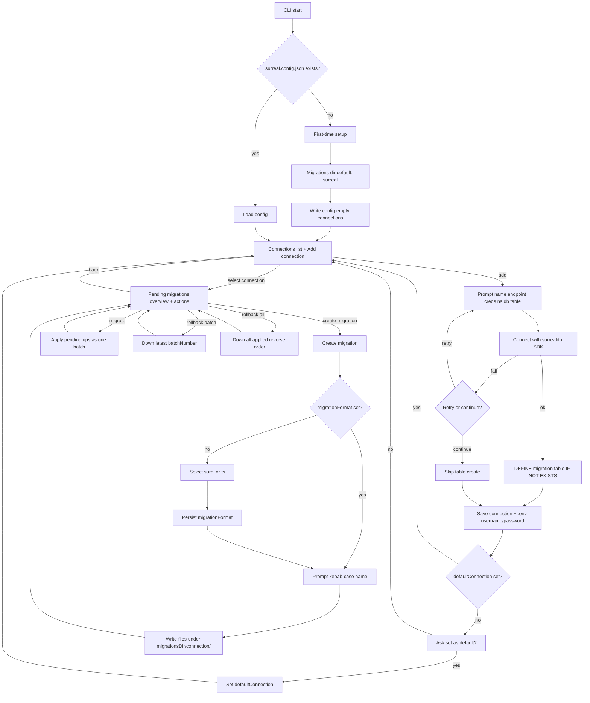

# Surreal Migrator — interactive flow

```mermaid
flowchart TD
  start[CLI start] --> hasConfig{surreal.config.json exists?}
  hasConfig -->|no| setup[First-time setup]
  setup --> pathPrompt["Migrations dir default: surreal"]
  pathPrompt --> saveConfig["Write config empty connections"]
  hasConfig -->|yes| loadConfig[Load config]
  saveConfig --> connectionsMenu
  loadConfig --> connectionsMenu[Connections list + Add connection]
  connectionsMenu -->|select connection| connectionMenu[Pending migrations overview + actions]
  connectionsMenu -->|add| addConn["Prompt name endpoint creds ns db table"]
  addConn --> verify[Connect with surrealdb SDK]
  verify -->|ok| ensureTable["DEFINE migration table IF NOT EXISTS"]
  verify -->|fail| retryOrContinue{Retry or continue?}
  retryOrContinue -->|retry| addConn
  retryOrContinue -->|continue| skipTable[Skip table create]
  ensureTable --> saveConn["Save connection + .env username/password"]
  skipTable --> saveConn
  saveConn --> hasDefault{defaultConnection set?}
  hasDefault -->|no| askDefault["Ask set as default?"]
  askDefault -->|yes| setDefault[Set defaultConnection]
  askDefault -->|no| connectionsMenu
  setDefault --> connectionsMenu
  hasDefault -->|yes| connectionsMenu
  connectionMenu -->|create migration| createMig[Create migration]
  createMig --> hasFormat{migrationFormat set?}
  hasFormat -->|no| pickFormat["Select surql or ts"]
  pickFormat --> saveFormat[Persist migrationFormat]
  hasFormat -->|yes| namePrompt
  saveFormat --> namePrompt["Prompt kebab-case name"]
  namePrompt --> writeFiles["Write files under migrationsDir/connection/"]
  writeFiles --> connectionMenu
  connectionMenu -->|migrate| migrateUp["Apply pending ups as one batch"]
  connectionMenu -->|rollback batch| rollbackBatch["Down latest batchNumber"]
  connectionMenu -->|rollback all| rollbackAll["Down all applied reverse order"]
  migrateUp --> connectionMenu
  rollbackBatch --> connectionMenu
  rollbackAll --> connectionMenu
  connectionMenu -->|back| connectionsMenu
```
