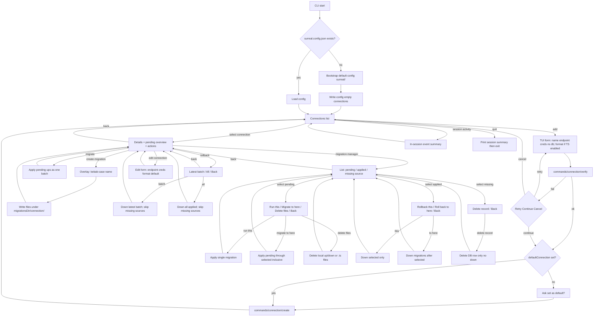

# Surreal Migrator — interactive flow

## Notes

- **Paths** in the TUI are breadcrumbs (for example `connections / my-db / manager`), not clickable yet.
- **Missing source** means a DB migration record exists without local files. Rollbacks that need those files **skip** them and report what was skipped; use **Delete migration record** only for mismatch cleanup.
- **Delete source files** (pending only) removes local migration files and does not touch the database.
- **Session activity** is in-memory for the current process and is printed on exit when non-empty.
