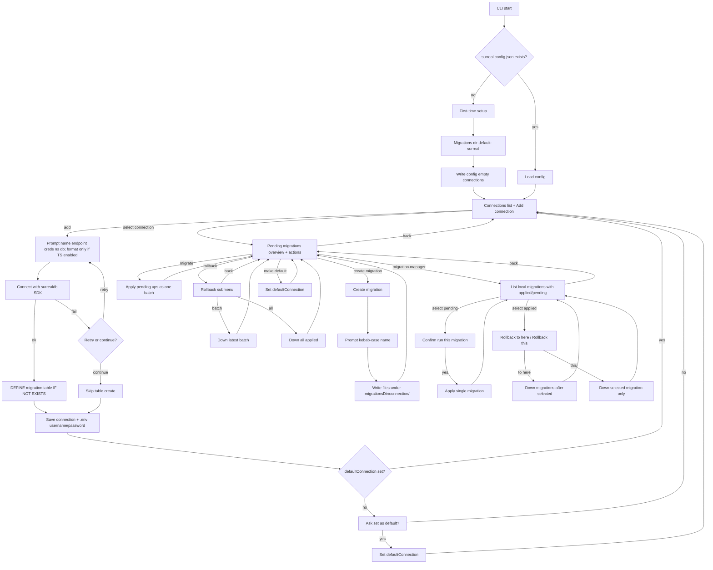

# Surreal Migrator — interactive flow

```mermaid
flowchart TD
  start[CLI start] --> hasConfig{surreal.config.json exists?}
  hasConfig -->|no| setup[First-time setup]
  setup --> pathPrompt["Migrations dir default: surreal"]
  pathPrompt --> saveConfig["Write config empty connections"]
  hasConfig -->|yes| loadConfig[Load config]
  saveConfig --> connectionsMenu
  loadConfig --> connectionsMenu[Connections list + Add connection]
  connectionsMenu -->|select connection| connectionMenu[Pending migrations overview + actions]
  connectionsMenu -->|add| addConn["Prompt name endpoint creds ns db; format only if TS enabled"]
  addConn --> verify[Connect with surrealdb SDK]
  verify -->|ok| ensureTable["DEFINE migration table IF NOT EXISTS"]
  verify -->|fail| retryOrContinue{Retry or continue?}
  retryOrContinue -->|retry| addConn
  retryOrContinue -->|continue| skipTable[Skip table create]
  ensureTable --> saveConn["Save connection + .env username/password"]
  skipTable --> saveConn
  saveConn --> hasDefault{defaultConnection set?}
  hasDefault -->|no| askDefault["Ask set as default?"]
  askDefault -->|yes| setDefault[Set defaultConnection]
  askDefault -->|no| connectionsMenu
  setDefault --> connectionsMenu
  hasDefault -->|yes| connectionsMenu
  connectionMenu -->|create migration| createMig[Create migration]
  createMig --> namePrompt["Prompt kebab-case name"]
  namePrompt --> writeFiles["Write files under migrationsDir/connection/"]
  writeFiles --> connectionMenu
  connectionMenu -->|migrate| migrateUp["Apply pending ups as one batch"]
  connectionMenu -->|rollback| rollbackMenu[Rollback submenu]
  rollbackMenu -->|batch| rollbackBatch["Down latest batch"]
  rollbackMenu -->|all| rollbackAll["Down all applied"]
  rollbackMenu -->|back| connectionMenu
  connectionMenu -->|migration manager| managerList["List local migrations with applied/pending"]
  managerList -->|select pending| confirmRun["Confirm run this migration"]
  confirmRun -->|yes| migrateOne["Apply single migration"]
  managerList -->|select applied| appliedMenu["Rollback to here / Rollback this"]
  appliedMenu -->|to here| rollbackAfter["Down migrations after selected"]
  appliedMenu -->|this| rollbackOne["Down selected migration only"]
  migrateUp --> connectionMenu
  rollbackBatch --> connectionMenu
  rollbackAll --> connectionMenu
  migrateOne --> managerList
  rollbackAfter --> managerList
  rollbackOne --> managerList
  managerList -->|back| connectionMenu
  connectionMenu -->|make default| setDefaultFromMenu[Set defaultConnection]
  setDefaultFromMenu --> connectionMenu
  connectionMenu -->|back| connectionsMenu
```
